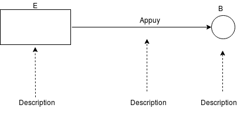

# Projet

À faire : (binome/trinome)

Qu'est-ce que le compte rendu de tp ?

- Connexion BDD en MVC doit être mis en oeuvre
- Il doit être compris entre 5 à 6 pages  (sinon jeté !)
- Le code source est mis en annexe
- Introduisez le sujet chapitre : "Connexion Java Base de donnée"
- Expliquez les mécanismes mis en oeuvre et citez nos sources (doc java, cour...)
- Toutes les explications doivent être illustré par des schémas :
    remarque importante :  les schémas doivent être simple (type cour) :

          - pas de couleur
          - pas d'image
          - pas d'icon
          - que des cercle , trait , carreaux, des rectanlges, des flèches ...

          Etiquetter le nombre d'évènement, étiquetter ces évènement

- Le code doit avoir une documentation générée !
- Pas de capture d'écran
- Pas de code dans les 5 - 6 pages
- /!\ Si difficulté : l'écrire, le justifier, et donner les démarches que nous avons fait /!\ 

# Utilisation du programme

- Cloner le projet
- Exécuter le fichier SQL (Create_bdd_and_insert.sql) dans votre base de donnée (surment l'exécuter 2 fois , cf commentaire dans le fichier)
- Rechercher le driver correspondant à la version de votre base de donnée (de préférence MySQL) et le télécharger
- importer le driver dans le projet (si vous utilisez un IDE, mettez le driver dans le dossier librairies)
- modifier le fichier Programme/src/com/jdbc/ConnectDatabase.java avec le bon nom de driver et les bons champs de connexion à la base de donnée
- exécuter Programme/src/com/main/Main.java
